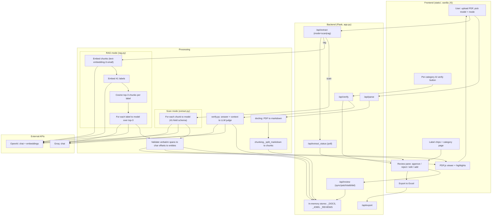

# CUAD Contract Highlighter — Web UI

A displaCy-style UI for the CUAD pipeline. Upload a contract PDF, pick a model,
and the backend parses it to markdown (docling), scans it for all **41 CUAD
clause categories**, and shows the document with colour-coded highlights.

It offers **two extraction modes** and a **per-category AI verification** pass:

```
PDF ─docling─▶ markdown ─_split_markdown─▶ chunks
                                             │
             ┌───────────────────────────────┴───────────────────────────────┐
             │ MODE = "scan" (default)          │ MODE = "rag"                 │
             │ per-chunk structured extraction  │ embed chunks + labels        │
             │ each chunk → all 41 fields       │ (text-embedding-3-small),    │
             │ OpenAI (ChatOpenAI)/Groq(ChatGroq)│ for each label retrieve      │
             │                                  │ top-3 chunks → 1 call/label  │
             └───────────────────────────────┬───────────────────────────────┘
                                             │
                          verbatim spans ─▶ char offsets ─▶ highlights
                                             │
                       (optional) per-category  🤖 AI verify  → correct / incorrect / unsure
```

It reuses the project's existing code: `category_descriptions.csv` for the 41
categories, `chunking._split_markdown` for the markdown chunking strategy, and
the same structured-output approach as `OpenAITest.py`.

## Run

```bash
# 1. install deps (from the repo root)
pip install -r webui/requirements.txt

# 2. create your key file — .env is gitignored, so real keys never reach GitHub
cp .env.example .env      # then edit .env and paste your real keys

# 3. start the server
cd webui
python app.py
# open http://127.0.0.1:5000
```

Needs `OPENAI_API_KEY` and `GROQ_API_KEY` in the project-root `.env` (see
[.env.example](../.env.example)). `OPENAI_API_KEY` is always needed for RAG-mode
embeddings; `GROQ_API_KEY` only if you pick a Groq model.

> **First parse is slow.** docling initialises/loads its layout models on the
> first PDF (tens of seconds). Later parses are a few seconds. The loading
> overlay shows the current stage.

## Pages

- **`/`** — main highlighter.
  1. Choose a PDF, a model, and an **extraction mode** (Full scan or RAG — see
     [Extraction modes](#extraction-modes-full-scan-vs-rag)), click **Analyze**.
  2. Label chips appear top — click to toggle each label's highlight on/off
     (Select all / None buttons too). Each label has its own colour.
  3. **Left pane = the actual PDF** (rendered with PDF.js) with the selected
     clauses highlighted on it. **Right pane = a review surface**: every answer
     for the selected labels, grouped by label.
  4. **Re-run model** re-runs extraction on the *already-parsed* document with a
     different model — no re-parsing. Your review decisions are kept (merged).

  Highlighting on the PDF works by searching the page's text layer for each
  extracted span (whitespace-tolerant, matches across line/word splits) and
  tinting the matching text. It's at text-item granularity, which is robust for
  the native-text CUAD PDFs. A span that can't be located on the page (e.g. one
  that crosses a page break) still appears in the right pane.

  **Review workflow (right pane):**
  - **Click any answer** to jump to it on the PDF — it scrolls the PDF pane to
    the match and flashes it. (Uses the same text-layer search as highlighting.)
  - Each answer has **Approve / Reject / Edit** buttons. Rejected answers are
    struck through and dropped from the PDF highlights and the export; clicking
    an active status again clears it back to *unreviewed*.
  - **🤖 AI verify** (per category group header) asks the model selected in the
    top dropdown to audit every answer in that category and tags each with a
    **correct ✓ / incorrect ✗ / unsure ?** pill (hover for the reason). See
    [AI verification](#ai-verification-per-category).
  - **Edit** opens an inline editor; saving marks the answer *edited*.
  - Every label group ends with **+ Add answer** to add an answer the model
    missed (marked *manual*; it gets highlighted on the PDF too if found there).
    Manual answers can be removed with the ✕ button.
  - **⭳ Export to Excel** (right-pane header) downloads the reviewed answers as
    `<pdf-name>_highlights.xlsx` — columns **Category · Answer · Status · Page**.
    Rejected answers are excluded; the page is where the answer was located on
    the PDF (blank if it couldn't be located).
  - Drag the **splitter** between the two panes to resize them; the PDF re-fits
    to the new width on release. The split ratio is remembered (localStorage).
  - **Zoom** the PDF with the **− / + / Fit** controls in the PDF pane header
    (or **Ctrl/Cmd + scroll** over the PDF). Pages are re-rendered at the new
    scale — sharp at any zoom, and the pane/window size is unchanged; the view
    keeps its position and highlights stay aligned.
  - **Find in the PDF** with the search bar under the PDF pane header (like a
    normal PDF viewer): type a keyword to tint **every** occurrence, and step
    through them with **▲ / ▼** or **Enter / Shift+Enter**; the counter shows
    *current / total*. This is independent of the label highlights — search tints
    sit on top of them. **Esc** or the **×** clears it.
  - **+ Add category** (next to the label chips) lets you define your own clause
    category — a **label**, a **description**, and an optional **answer type**.
    The description is sent to the model as the extraction prompt, exactly like
    the 41 built-ins, so clicking **Re-run model** finds and highlights it on the
    document. Custom categories are kept in memory (reset on server restart) and
    can be removed from the `/categories` page.

  Review decisions and manual answers **persist on the server per document**
  (kept in memory until the server restarts). The page also remembers the last
  analysed document, so a reload restores the PDF and your review state.
- **`/categories`** — reference table of all categories (colour, description,
  answer format, group). Tick **Show** to control which categories appear as
  chips on the main page. Saved in the browser (localStorage); default = show all.
  **+ Add category** creates a custom category (label + description + answer
  type) that flows into the model just like the built-ins; custom rows are
  tagged and can be removed with the **×** button.

## Model dropdown

| Model | Provider |
|-------|----------|
| GPT-5.5 / GPT-5.4 / GPT-5.4-mini / GPT-4o-mini | OpenAI |
| Llama-3.3-70B / GPT-OSS-120B / Qwen3-32B | Groq |

The backend prints a per-run status to the terminal (docling timing + chars +
chunk sizes, then per-chunk OK/FAILED, clause types hit, token usage and
estimated cost) — the same detail as the old CLI runs. If a model fails on
every chunk (e.g. a decommissioned Groq id or a bad key), `/api/extract`
returns an error and the UI shows it instead of a silent empty result.

To add/remove models, edit the `MODELS` list in [extract.py](extract.py).

## Extraction modes: Full scan vs RAG

The **Extraction mode** dropdown (next to the model) picks how chunks reach the
model.

### Full scan (default) — *chunk-centric*
Every chunk is sent to the model once, asking for **all 41 categories at the same
time** (one Pydantic model with 41 `Optional[str]` fields). `N` chunks → `N`
model calls. This is the original [OpenAITest.py](../OpenAITest.py) behaviour.

### RAG — *label-centric* ([rag.py](rag.py))
1. **Embed** every chunk once with OpenAI **`text-embedding-3-small`** (1536-dim,
   L2-normalised) and cache the matrix on the parsed doc.
2. **Embed** every category as `"<label>. <description>"`.
3. For each category, rank chunks by **cosine similarity** and keep the **top-3**.
4. Ask the model about **that one category** over just those 3 chunks.

So `41` category calls, each over `k=3` retrieved chunks, instead of `N`
whole-document chunk calls. Chunk embeddings are cached (`_DOCS[doc_id]["chunk_emb"]`),
so switching the LLM or re-running RAG does **not** re-embed.

Retrieval is exact brute-force cosine similarity over a NumPy matrix — for one
contract (tens of chunks) that is microseconds, so no external vector DB
(FAISS/Chroma/pgvector) is needed. Swap in one only if you index *many*
contracts at once.

### Advantages of the RAG approach
- **Smaller, focused prompts.** Each call sees ~3 relevant chunks for one
  category instead of a whole chunk graded against 41 descriptions — less room
  for the model to get distracted or dilute attention across categories.
- **Cost scales with #labels, not document length.** For a long contract with
  many chunks, "41 calls over 3 chunks each" can send far fewer tokens than
  "every chunk × the full 41-field schema".
- **Embeddings are cheap and reusable.** `text-embedding-3-small` is ~$0.02 / 1M
  tokens; embedding a contract costs a fraction of a cent and is cached.
- **Interpretable retrieval.** You can inspect *which* chunks were fed for each
  category — useful for debugging misses.
- **Foundation for scale.** The same embeddings enable cross-contract search,
  clustering, and dedup later.

### Disadvantages / risks
- **Recall depends on `k`.** If a clause lives in a chunk that isn't in the
  top-3 for its label, RAG never sees it → a miss. Full scan reads *everything*,
  so it can't miss a chunk for that reason. Raise `DEFAULT_TOP_K` in
  [rag.py](rag.py) to trade cost for recall.
- **Embedding ≠ legal relevance.** Cosine similarity of a short label sentence
  vs a chunk is a proxy; some categories (e.g. broad "Governing Law") retrieve
  well, others (rare, phrased-unusually clauses) retrieve poorly.
- **More calls when the doc is short.** For a small contract (few chunks), "41
  calls" is *more* requests than "5 chunk calls", so latency/cost can be worse.
- **Two failure surfaces.** An embedding outage or an OpenAI-key issue breaks
  RAG even if you extract with a Groq LLM (Groq has no embedding endpoint).
- **Chunk-boundary loss.** A clause split across two chunks may only partly land
  in the retrieved set.

### Does it boost accuracy?
**It depends — RAG mainly trades recall for precision, and does not reliably
raise F1 on this task.** In CUAD-style extraction the usual pattern is:

- **Precision** often **improves**: focused, per-label prompts reduce
  cross-category confusion and spurious spans.
- **Recall** is **capped by retrieval**: with `k=3`, any clause outside the
  top-3 chunks is unreachable, so recall can *drop* vs a full scan that reads
  every chunk. Full scan is effectively `k = all chunks`.
- **Net F1** therefore hinges on `k` and chunk quality. Small/precise `k` →
  higher precision, lower recall. Larger `k` → recall approaches full scan but
  the token savings shrink.

**Bottom line:** treat RAG as a cost/precision lever, not a guaranteed accuracy
win. If your goal is maximum recall (find every clause), full scan is the safe
default; RAG shines when documents are long and you want cheaper, cleaner
per-category answers. To actually *measure* it on CUAD, run both modes and score
with [evaluate.py](../evaluate.py) (Precision / Recall / F1 / AUPR), and sweep
`DEFAULT_TOP_K`.

> RAG needs `OPENAI_API_KEY` for embeddings regardless of which LLM you pick.

## AI verification (per category)

Each category group in the right pane has a **🤖 AI verify** button
([verify.py](verify.py)). Clicking it asks the model **currently selected in the
top dropdown** to audit every non-rejected answer in that category:

- For each answer, the backend locates it in the document and sends the answer
  **plus its surrounding context** (±400 chars) to the model.
- The model returns a verdict per answer: **correct** ✓ / **incorrect** ✗ /
  **unsure** ?, with a one-sentence reason.
- The verdict appears as a coloured pill next to the answer (hover for the
  reason and which model verified it). It's stored server-side per answer, so it
  survives a reload, flows into the Excel export (**AI Verdict** column), and is
  cleared automatically if you edit the answer text.

This is a cheap second-opinion / LLM-as-judge pass. Pick a **stronger model** in
the dropdown to verify a **cheaper model's** output (e.g. extract with
GPT-4o-mini, verify with GPT-5.5), or use a different provider entirely as an
independent check.

## API

| Method | Route | Purpose |
|--------|-------|---------|
| GET  | `/api/models`     | dropdown contents |
| GET  | `/api/categories` | categories with colours/descriptions (41 built-in + any custom) |
| POST | `/api/categories` | add a custom category `{label, description, answer_format?}` → the new category |
| DELETE | `/api/categories/<label>` | remove a custom category (built-ins can't be removed) |
| POST | `/api/parse`      | multipart `file` → `{doc_id, n_chunks}` (PDF bytes cached server-side) |
| GET  | `/api/pdf/<doc_id>` | the original PDF bytes, for PDF.js to render |
| POST | `/api/extract`    | json `{doc_id, model, mode?}` (`mode`=`scan`\|`rag`, default `scan`) → `{job_id, total, mode}` |
| GET  | `/api/extract_status/<job_id>` | live progress → `{stage, completed, total, ok, failed, finished, mode, result?, error?}` (`stage` can be `embedding` in RAG mode) |
| POST | `/api/verify/<doc_id>` | AI-verify one category `{label, model}` → `{items}` (each with a `verify` verdict) |
| GET  | `/api/review/<doc_id>` | current review items (used to restore after reload) |
| POST | `/api/review/<doc_id>/sync` | merge the model's answers into review state → `{items}` |
| PATCH | `/api/review/<doc_id>/<item_id>` | update status (approve/reject), text (edit; clears any AI verdict), and/or page |
| POST | `/api/review/<doc_id>` | add a manual answer `{label, text, page}` |
| DELETE | `/api/review/<doc_id>/<item_id>` | remove an item (discard a manual answer) |
| GET  | `/api/export/<doc_id>` | download reviewed answers as `.xlsx` (rejected excluded; incl. **AI Verdict** column) |

Extraction runs in a background thread and the UI **polls for live progress**,
so the loading overlay shows a real progress bar (chunk *N / total*, %) instead
of an opaque spinner. Each chunk is one model call; the bar advances as chunks
finish. This is what makes a slow reasoning model (e.g. Qwen3) visibly *running*
rather than apparently stuck.

Parsed documents are cached in memory by `doc_id` (last 20), so switching models
is cheap. Restarting the server clears the cache.

### OCR

OCR is **off** by default (`OCR_ENABLED = False` in [extract.py](extract.py)) —
the CUAD contracts are native-text PDFs, so OCR only wastes time. Set it to
`True` if you ever feed in scanned/image PDFs.

### PDF backend fallback

`parse_pdf_to_text` uses docling's default PDF backend, but **falls back to the
`pypdfium2` backend** if the default one throws. Some installed
docling / docling-parse version combinations (e.g. docling 2.97 with
docling-parse 7.0) raise inside the default backend
(`DecodePageConfig … has no attribute materialize_bitmap_bytes`); the fallback
keeps parsing working without pinning versions.

## Files

```
webui/
  app.py              Flask server (parse/extract/verify/review/export routes)
  extract.py          categories, schema, docling parse, OpenAI/Groq scan extraction, offsets
  rag.py              RAG mode: embeddings (text-embedding-3-small) + top-k retrieval + per-label extraction
  verify.py           AI verification: per-category LLM-as-judge over answers + context
  static/
    index.html        main highlighter page (model + extraction-mode dropdowns)
    categories.html   41-category reference page
    style.css         displaCy-inspired styling
    app.js            main page logic (highlight rendering, chips, AI-verify, verdict badges)
    pdfview.js        PDF.js viewer + text-layer highlighting/search for the left pane
    categories.js     reference page (show/hide → localStorage)
    vendor/           PDF.js served locally (pdf.min.js + pdf.worker.min.js) — no CDN
```

> **PDF.js is vendored locally** in `static/vendor/` (v3.11.174) rather than
> loaded from a CDN, so the viewer works offline and isn't blocked by browser
> tracking-prevention. To upgrade, drop newer `pdf.min.js` / `pdf.worker.min.js`
> into that folder (the worker path is set in [pdfview.js](static/pdfview.js)).

## Architecture & pipeline (for draw.io)

The whole system — frontend, backend, both extraction modes, and verification —
is captured below in two formats you can import straight into **draw.io**
(diagrams.net):

- **Mermaid** (recommended): in draw.io, **Extras → Insert → Advanced →
  Mermaid…** (or **Arrange → Insert → Advanced → Mermaid…** depending on
  version), paste the block below, Insert.
- **CSV**: **Extras → Insert → Advanced → CSV…**, paste the CSV block, Import.

### Mermaid



### CSV (draw.io native import)

```
## draw.io CSV import — CUAD Highlighter pipeline
# label: %step%
# style: rounded=1;whiteSpace=wrap;html=1;fillColor=%fill%;
# namespace: csvimport-
# connect: {"from":"next","to":"id","style":"endArrow=block;html=1;"}
# width: 170
# height: 50
# padding: 12
# nodespacing: 40
# levelspacing: 60
# layout: verticalflow
id,step,fill,next
u,User: upload PDF + pick model/mode,#dae8fc,parse
parse,POST /api/parse,#d5e8d4,docling
docling,docling: PDF -> markdown,#d5e8d4,chunk
chunk,chunking._split_markdown -> chunks,#d5e8d4,extract
extract,POST /api/extract (scan|rag),#d5e8d4,"scan,rag"
scan,SCAN: each chunk -> model (41 fields),#ffe6cc,offsets
rag,"RAG: embed chunks+labels, cosine top-3 -> model/label",#ffe6cc,offsets
offsets,Validate spans -> char offsets -> entities,#ffe6cc,pdfview
pdfview,PDF.js viewer + highlights,#dae8fc,review
review,Review pane (approve/reject/edit/add),#dae8fc,verify
verify,POST /api/verify -> LLM judge (correct/incorrect),#fff2cc,export
export,GET /api/export -> Excel,#dae8fc,
```

> The CSV import is a simplified linear view (draw.io CSV edges are one-to-one);
> the Mermaid block is the fuller graph with both modes branching and the
> external OpenAI/Groq calls. Use whichever your draw.io version imports more
> cleanly.
